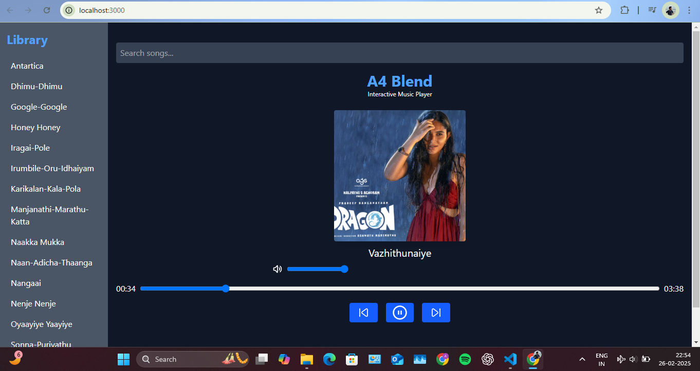

# A4 Blend
## Music Player App

A modern music player built with React, Vite, and Tailwind CSS. This application allows users to play local MP3 files, extract metadata (including cover art), and manage a playlist with search functionality.

 <!-- Add a screenshot if available -->

## Features

- **Play Local MP3 Files**: Load and play MP3 files from the `public/songs` directory.
- **Metadata Extraction**: Extract song metadata (title, artist, album, cover art) using `music-metadata-browser`.
- **Playlist Management**: Browse, search, and play songs from the playlist.
- **Responsive Design**: Built with Tailwind CSS for a clean and responsive UI.
- **Volume Control**: Adjust volume and mute/unmute the player.
- **Progress Bar**: Seek through the song using a progress bar.

## Technologies Used

- **React**: A JavaScript library for building user interfaces.
- **Vite**: A fast build tool for modern web development.
- **Tailwind CSS**: A utility-first CSS framework for rapid UI development.
- **music-metadata-browser**: A library for extracting metadata from audio files.

## Getting Started

### Prerequisites

- Node.js (v16 or higher)
- npm (v7 or higher)

### Installation

1. Clone the repository:

   ```bash
   git clone https://github.com/your-username/music-player.git
   cd music-player
   ```
2. Install dependencies:

   ```bash
      npm install
   ```
-Add your MP3 files to the public/songs directory. Ensure the files have embedded metadata (e.g., title, artist, cover art).

3. Start the development server:

   ```bash
      npm run dev
   ```
  - Open your browser and navigate to http://localhost:3000.


##Usage
Search: Use the search bar to filter songs by title.

Play/Pause: Click the play/pause button to control playback.

Volume Control: Adjust the volume slider or click the mute button.

Next/Previous: Use the next and previous buttons to navigate through the playlist.

##Folder Structure

music-player/
├── public/
│   ├── songs/            # Directory for MP3 files
│   └── assets/           # Default cover art and other static assets
├── src/
│   ├── components/       # React components
│   ├── App.jsx           # Main application component
│   └── main.jsx          # Entry point
├── .gitignore            # Files and directories to ignore
├── package.json          # Project dependencies and scripts
├── README.md             # Project documentation
└── vite.config.js        # Vite configuration

##Contributing
Contributions are welcome! If you'd like to contribute, please follow these steps:

Fork the repository.

Create a new branch (git checkout -b feature/YourFeatureName).

Commit your changes (git commit -m 'Add some feature').

Push to the branch (git push origin feature/YourFeatureName).

Open a pull request.

##License
This project is licensed under the MIT License. See the LICENSE file for details.

##Acknowledgments
Vite for the fast development environment.

Tailwind CSS for the utility-first CSS framework.

music-metadata-browser for metadata extraction.

Made with ❤️ by Aadhi Kabilan


